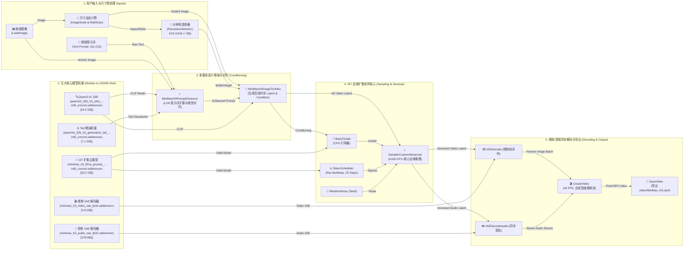

# Qwen3-VL 32B H3 模型架构与 ConvRot 技术详解

## 1. 模型仓库文件作用解析

当前 Hugging Face 页面 [ethanfel/Qwen3-VL-32B-Ultra-Heretic-H3-ComfyUI-INT8-ConvRot](https://huggingface.co/ethanfel/Qwen3-VL-32B-Ultra-Heretic-H3-ComfyUI-INT8-ConvRot/tree/main) 中的文件对应于 **Qwen3-VL 32B** 在 ComfyUI 架构下的 **H3 拆分模块**，主要包含条件编码器（Conditioning Encoder）**与**生成尾部（Generation Tail）两大类文件：

### 编码器模块（主模型部分）

* **`qwen3vl_32b_h3_ultra_uncensored_heretic_bf16.safetensors` (51.5 GB)**
* **作用**：去限制（Uncensored/Heretic）版本的 BF16 全精度主编码器，负责理解图像与复杂提示词输入。
* **特点**：保持最高精度与完整细节理解力，需要较多显存。


* **`qwen3vl_32b_h3_ultra_uncensored_heretic_int8_convrot.safetensors` (26.4 GB)**
* **作用**：经过 INT8 量化及 ConvRot 优化后的去限制主编码器（涵盖 0–49 层网络）。
* **特点**：体积和显存占用降低约 50%，显著提升运行速度，适合中等显存显卡。


---

### 生成尾部模块（Tail Modules / 50-63层）

这类文件配合主编码器完成文本或图像生成的后续推理阶段，提供不同量化版本以适配硬件：

* **`qwen3vl_32b_h3_instruct_generation_tail_50_63_bf16.safetensors` (15.2 GB)**
* **作用**：官方/Instruct 对齐风格的未量化（BF16）生成尾部，提供原汁原味的生成与输出质量。


* **`qwen3vl_32b_h3_instruct_generation_tail_50_63_int8_convrot.safetensors` (7.61 GB)**
* **作用**：Instruct 风格的 INT8 量化尾部，平衡了速度与生成质量。


* **`qwen3vl_32b_h3_instruct_generation_tail_50_63_nvfp4_awq.safetensors` (5.4 GB)**
* **作用**：针对 NVIDIA 显卡优化的 NVFP4/AWQ 极高压缩率尾部，显存占用最小，推理速度极快。


* **`qwen3vl_32b_h3_generation_tail_50_63_int8_convrot.safetensors` (7.61 GB)**
* **作用**：基础（非 Instruct 特化）版本的 INT8 尾部，用于通用生成任务。


---

## 2. Generation Tail（生成尾部）详解

在像 **Qwen2/Qwen3-VL** 这种超大型的多模态与语言模型中，**Generation Tail（生成尾部）** 指的是**模型后半部分的网络层**（在此仓库中具体指第 50 到 63 层）。

### 为什么要把“尾部”单独拆出来？

* **分阶段推理（Split Architecture）**：模型前半部分（1–49层）主要负责**图像与提示词的特征提取与条件编码**；而最后几层（50–63层）则直接接在输出层之前，负责**自回归生成具体的 Token（文本/特征）**。
* **显存与硬件优化**：尾部模块体积较小，单独拆分后可以对其施加不同精度的量化（如 BF16、INT8、NVFP4/AWQ），或者将其加载到不同的显卡/内存区域，大幅降低生成推理时的显存开销。

---

## 3. 自回归（Autoregressive）与 Token 输出机制

在当前这类模型（如 ComfyUI 调用的 Qwen3-VL 架构）中，自回归生成的 Token **既包括给机器看的 Latent/特征，也包括最终直接给用户看的文本/图像特征**：

1. **给机器看的 Latent / 特征（Conditioning & Latent Generation）**：如果是图像生成或 Diffusion 模型中的文本引导节点，模型生成/处理的向量（Latent Token）会继续作为 Conditioning 输入给 VAE 解码器或 UNet/DiT 节点，纯粹由机器后级处理。
2. **给用户看的 Output Token（Text Output）**：如果 Qwen3-VL 被用于图像描述（Captioning）、视觉问答或指令跟随，Generation Tail 解码出来的 Token 会经过一个 LM Head（词表映射层），还原成具体的文字词汇，直接展示给用户。

### 什么是“自回归”？

简单来说，**自回归就是“逐字/逐 Token 递归生成”，即“用自己前面生成的输出，作为下一步的输入”**。

* **Step 1**：输入 Prompt，模型预测出第 1 个词：`An`
* **Step 2**：将 `Prompt + "An"` 重新作为输入，模型预测出第 2 个词：`astronaut`
* **Step 3**：将 `Prompt + "An" + "astronaut"` 重新作为输入，预测出第 3 个词：`riding`
* 循环往复，直到生成终止符号（`<EOS>`）。

---

## 4. 显存叠加机制与主模型大小分析

### 为什么 `...int8_convrot.safetensors`（26.4 GB）体积最大？

该文件扮演的角色是**模型的前半部分主体（0 到 49 层，共 50 层 Transformer Block）**，包含了近 80% 的模型参数与架构，以及图像编码（Vision Tower）与文本 Embedding 层。而其他尾部文件仅仅包含最后 50 到 63 层（14 层网络），因而体积较小。

### Tail 模型与主模型的显存是否会叠加？

**是的，一定会叠加。**
完整的推理过程需要数据从主模型（0–49层）流向尾部（50–63层）。两者的显存开销（以及 KV Cache 等运行时显存）会在 GPU 显存中累加：

* **INT8 主编码器**（26.4 GB） + **INT8 尾部**（7.61 GB） $\approx$ **34.01 GB** 模型基础显存（加上 KV Cache 等，全流程运行通常需要约 40 GB 显存）。

---

## 5. ConvRot 技术原理深度剖析

**ConvRot**（Convolutional Rotation）是一种针对 Transformer 模型量化时设计的**激活值异常值（Outliers）平滑与消除技术**。

### 为什么过激的异常值在 AI 中不被欢迎？

在将大模型量化为 INT8 时，极少数数值巨大的“离群值/异常值”会破坏“量化网格”：

* **破坏精度**：固定 256 个格子（`-128` 到 `127`）为了适配极端异常值（如 `100`），强制拉大刻度，导致 99% 以上的正常微小数据四舍五入变成 `0`，模型逻辑崩溃。
* **降低效率**：若不处理异常值，工程上只能采取混合精度（Mixed Precision），引发 GPU 内部频繁类型转换与计算阻塞。

---

### ConvRot 如何用矩阵旋转平摊异常值？

假设激活值原本有一条极陡峭的尖峰：


$$\mathbf{X} = \begin{bmatrix} 100 \\ 0 \end{bmatrix}$$

在二维空间里乘以一个 $45^\circ$ 的正交旋转矩阵 $\mathbf{R}$：


$$\mathbf{R} = \begin{bmatrix} 0.707 & -0.707 \\ 0.707 & 0.707 \end{bmatrix}$$

旋转后的激活值变成：


$$\mathbf{X}_{\text{rotated}} = \mathbf{R} \times \mathbf{X} = \begin{bmatrix} 70.7 \\ 70.7 \end{bmatrix}$$


极端离群值被分担到了其他坐标轴，**波峰由 100 降到了 70.7**，不再拉稀 INT8 量化刻度。

#### 数学不变性与“反向旋转”

为了保证输出不变，数据乘以旋转矩阵 $\mathbf{R}$ 的同时，**权重矩阵也必须做反向旋转（乘以 $\mathbf{R}^T$）**：


$$\mathbf{Y} = (\mathbf{W} \mathbf{R}^T) \times (\mathbf{R} \mathbf{X})$$


因为正交矩阵满足 $\mathbf{R}^T \mathbf{R} = \mathbf{I}$（单位矩阵），旋转相互抵消，**最终输出结果 $\mathbf{Y}$ 完全保持一致**。

---

### 旋转与反旋转的执行阶段

| 阶段 | 操作对象 | 执行时间节点 | 执行者 |
| --- | --- | --- | --- |
| **反旋转 ($\mathbf{R}^T$)** | 权重矩阵 $\mathbf{W}$ | **离线准备阶段**（模型发布前，写入 `.safetensors`） | 模型开发者 |
| **正向旋转 ($\mathbf{R}$)** | 输入激活值 $\mathbf{X}$ | **推理计算阶段**（点击 Queue Prompt 的瞬间） | 本地 GPU |

由于权重反旋转在模型打包时已提前算好，本地推理时仅需在数据流入时实时旋转激活值并相乘，**既没丢精度，也几乎零额外耗时**。



```
    digraph MiniMax_H3_Workflow {
        rankdir=LR;
        splines=ortho;
        nodesep=0.6;
        ranksep=0.8;
        bgcolor="#1a1b26";

        node [
            fontname="Arial",
            fontsize=11,
            shape=rect,
            style="rounded,filled",
            penwidth=1.5,
            color="#414868",
            fontcolor="#c0caf5"
        ];

        edge [
            fontname="Arial",
            fontsize=9,
            color="#7aa2f7",
            fontcolor="#7aa2f7",
            penwidth=1.3
        ];

        // ==================== 1. 输入数据与尺寸控制 ====================
        subgraph cluster_input {
            label = "1. 用户输入与尺寸预处理 (Inputs)";
            fontcolor = "#7dcfff";
            style = "dashed";
            color = "#3b4261";
            bgcolor = "#24283b";

            node [fillcolor="#1f2335"];
            input_image [label="🖼️ 首帧图像\n(LoadImage)", fillcolor="#2ac3de", fontcolor="#15161e", shape=box3d];
            input_prompt [label="📝 视频提示词\n(Text Prompt: 15s CGI)", fillcolor="#bb9af7", fontcolor="#15161e"];
            res_selector [label="📐 分辨率选择器\n(ResolutionSelector)\n16:9 (1344 x 768)"];
            scale_calc [label="🧮 尺寸动态计算\n(ImageScale & MathExpr)"];
        }

        // ==================== 2. 5 大权重模型加载 ====================
        subgraph cluster_models {
            label = "2. 五大核心模型权重 (Models on 200GB Disk)";
            fontcolor = "#ff9e64";
            style = "dashed";
            color = "#3b4261";
            bgcolor = "#24283b";

            node [fillcolor="#2e3c64", color="#7aa2f7"];
            m_clip [label="🔤 Qwen3-VL 32B\n(qwen3vl_32b_h3_ultra_...\nint8_convrot.safetensors\n[24.5 GB])",
  fillcolor="#3d59a1"];
            m_tail [label="⚓ Tail 增强权重\n(qwen3vl_32b_h3_generation_tail_...\nint8_convrot.safetensors\n[7.1 GB])",
  fillcolor="#3d59a1"];
            m_dit [label="🧠 DiT 扩散主模型\n(minimax_h3_fl2va_pruned_...\nint8_convrot.safetensors\n[20.0 GB])",
  fillcolor="#f7768e", fontcolor="#15161e"];
            m_vae_v [label="🎬 视频 VAE 解码器\n(minimax_h3_video_vae_fp16.safetensors\n[4.9 GB])", fillcolor="#9ece6a",
  fontcolor="#15161e"];
            m_vae_a [label="🎵 音频 VAE 解码器\n(minimax_h3_audio_vae_fp32.safetensors\n[578 MB])", fillcolor="#9ece6a",
  fontcolor="#15161e"];
        }

        // ==================== 3. 提示词增强与条件编码 ====================
        subgraph cluster_enhancement {
            label = "3. 多模态语义增强与对齐 (Conditioning)";
            fontcolor = "#bb9af7";
            style = "dashed";
            color = "#3b4261";
            bgcolor = "#24283b";

            node [fillcolor="#1f2335"];
            enhancer [label="✨ MiniMaxH3PromptEnhancer\n(LLM 提示词扩展与视觉对齐)", fillcolor="#bb9af7",
  fontcolor="#15161e"];
            i2v_node [label="🎯 MiniMaxH3ImageToVideo\n(生成空间时序 Latent & Condition)", fillcolor="#7aa2f7",
  fontcolor="#15161e"];
        }

        // ==================== 4. DiT 采样去噪循环 ====================
        subgraph cluster_sampling {
            label = "4. DiT 去噪扩散采样核心 (Sampling & Denoise)";
            fontcolor = "#f7768e";
            style = "dashed";
            color = "#3b4261";
            bgcolor = "#24283b";

            node [fillcolor="#1f2335"];
            guider [label="🧭 BasicGuider\n(CFG 引导器)"];
            scheduler [label="📈 BasicScheduler\n(Res Multistep, 20 Steps)"];
            sampler [label="⚡ SamplerCustomAdvanced\n(A100 GPU 核心去噪推理)", fillcolor="#f7768e", fontcolor="#15161e"];
            noise [label="🎲 RandomNoise (Seed)"];
        }

        // ==================== 5. 解码与音视频多模态合成 ====================
        subgraph cluster_output {
            label = "5. 视频/音频同步解码与导出 (Decoding & Output)";
            fontcolor = "#9ece6a";
            style = "dashed";
            color = "#3b4261";
            bgcolor = "#24283b";

            node [fillcolor="#1f2335"];
            decode_video [label="🎞️ VAEDecode (视频帧序列)", fillcolor="#73daca", fontcolor="#15161e"];
            decode_audio [label="🔊 VAEDecodeAudio (同步音轨)", fillcolor="#73daca", fontcolor="#15161e"];
            create_video [label="🎬 CreateVideo\n(24 FPS, 合成音画视频流)", fillcolor="#9ece6a", fontcolor="#15161e"];
            save_video [label="💾 SaveVideo\n(导出 video/MiniMax_H3.mp4)", fillcolor="#e0af68", fontcolor="#15161e",
  shape=folder];
        }

        // ==================== 数据流连接 (Edges) ====================

        // 输入连接
        input_image -> scale_calc [label="Image"];
        scale_calc -> i2v_node [label="Scaled Image"];
        input_prompt -> enhancer [label="Raw Text"];
        res_selector -> i2v_node [label="Width/Height"];
        scale_calc -> res_selector [label="AspectRatio"];

        // 模型连接至条件器
        m_clip -> enhancer [label="CLIP Model"];
        m_tail -> enhancer [label="Tail Checkpoint"];
        enhancer -> i2v_node [label="Enhanced Prompt"];

        m_clip -> i2v_node [label="CLIP"];
        input_image -> enhancer [label="Anchor Image"];

        // 条件器输出至采样器
        i2v_node -> guider [label="Conditioning"];
        i2v_node -> sampler [label="Init Video Latent"];
        m_dit -> guider [label="UNet Model"];
        m_dit -> scheduler [label="UNet Model"];

        // 采样器内部拓扑
        guider -> sampler [label="Guider"];
        scheduler -> sampler [label="Sigmas"];
        noise -> sampler [label="Noise"];

        // 采样器输出至 VAE 解码
        sampler -> decode_video [label="Denoised Video Latent"];
        sampler -> decode_audio [label="Denoised Audio Latent"];

        m_vae_v -> decode_video [label="Video VAE"];
        m_vae_a -> decode_audio [label="Audio VAE"];

        // 多模态音视频合并
        decode_video -> create_video [label="Frames (Image Batch)"];
        decode_audio -> create_video [label="Stereo Audio Stream"];
        create_video -> save_video [label="Final MP4 Video"];
    }


```
